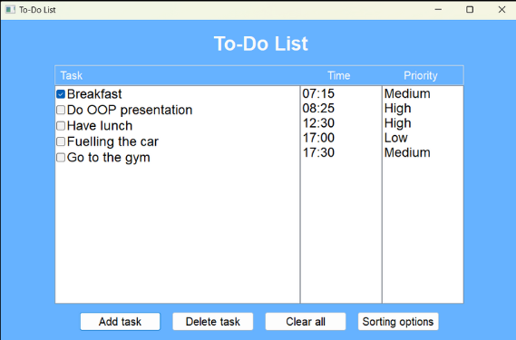

# To-Do List Application

Welcome to the To-Do List application! This project is designed to help users manage their tasks efficiently.

## Features

- **Add Tasks**: Easily add new tasks to your to-do list.
- **Edit Tasks**: Modify existing tasks as needed.
- **Delete Tasks**: Remove tasks that are no longer necessary.
- **Mark as Complete**: Check off tasks that have been completed.
- **Sort Tasks**: Organize tasks based on priority or time.

## Getting Started

To get a local copy of this project up and running, follow these steps:

### Prerequisites

- **C++ Compiler**: Ensure you have a C++ compiler installed on your system.

### Installation

1. **Clone the Repository**:
   ```bash
   git clone https://github.com/alexsto03ckel/To-Do-List.git
   ```
2. **Navigate to the Project Directory**:
   ```bash
   cd To-Do-List
   ```
3. **Compile the Application**:
   ```bash
   g++ -o ToDoList App.cpp MainFrame.cpp Task.cpp
   ```
4. **Run the Application**:
   ```bash
   ./ToDoList
   ```

## Usage

Upon running the application, you will see a graphical interface with the following features:

- **Task List**: Displays tasks along with their time and priority.
- **Checkboxes**: Mark tasks as complete by selecting the checkbox.
- **Add Task Button**: Allows users to add a new task.
- **Delete Task Button**: Removes a selected task.
- **Clear All Button**: Removes all tasks from the list.
- **Sorting Options**: Enables sorting tasks by priority or time.

### Screenshot

Here is how the application looks:



## Contributing

Contributions are welcome! If you'd like to contribute:

1. Fork the repository.
2. Create a new branch:
   ```bash
   git checkout -b feature/YourFeature
   ```
3. Commit your changes:
   ```bash
   git commit -m "Add YourFeature"
   ```
4. Push to the branch:
   ```bash
   git push origin feature/YourFeature
   ```
5. Open a Pull Request.

## License

This project is licensed under the MIT License. See the `LICENSE` file for details.

## Contact

For any questions or suggestions, please open an issue in this repository.

